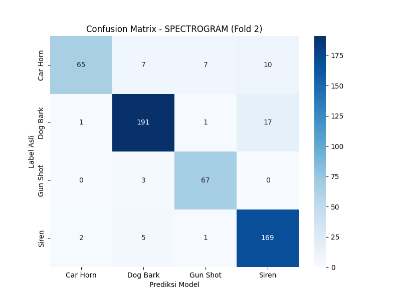
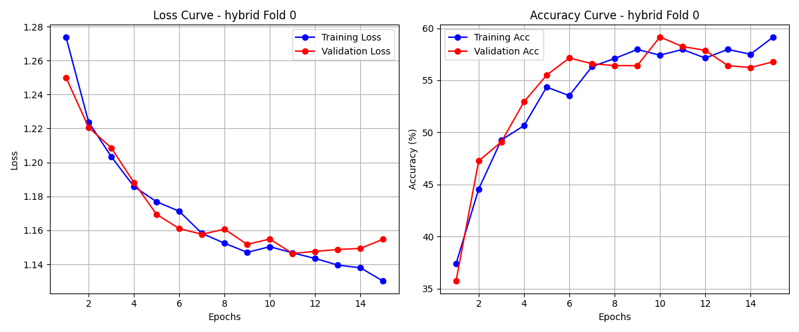

# 🔊 Analisis Model Untuk Klasifikasi Suara
**Skripsi / Tugas Akhir**
**Topik:** Analisis Metode Klasifikasi Suara Lingkungan (Environmental Sound Classification) untuk Keselamatan Penyandang Tuna Netra.

## 🎯 Tujuan Proyek
Mengembangkan sistem AI yang mampu mendeteksi suara berbahaya di sekitar pengguna secara real-time.
**Kelas Target:**
1.  🚨 **Siren** (Sirine Ambulans/Polisi)
2.  🚗 **Car Horn** (Klakson Kendaraan)
3.  🔫 **Gun Shot** (Suara Tembakan/Ledakan)
4.  🐶 **Dog Bark** (Gonggongan Anjing)

## 📊 Hasil Eksperimen (Model Benchmark)
Penelitian ini membandingkan tiga arsitektur Deep Learning dengan pendekatan input yang berbeda menggunakan dataset **UrbanSound8K**.

| Model Architecture | Input Type | Avg. Accuracy (5-Fold) | Best Fold Accuracy | Status |
| :--- | :--- | :--- | :--- | :--- |
| **Res1dNet31** | Waveform (1D) | ~78.26% | 82.60% | ✅ Good Baseline |
| **ResNet38 (PANNs)** | Spectrogram (2D) | **89.17%** | **90.11%** | 🏆 **Best Performance** |
| **Hybrid (Cnn14)** | Wavegram + Logmel | 58.64% | 60.22% | 📉 Underfitting |

### 💡 Analisis Hasil
1.  **Spectrogram (ResNet38) adalah yang Terbaik:**
    Model ini berhasil mencapai akurasi **90%**. Transformasi audio menjadi citra (Spectrogram) terbukti sangat efektif menangkap pola frekuensi unik, terutama membedakan suara *Car Horn* (datar) dan *Siren* (modulasi naik-turun) yang gagal dilakukan oleh model Waveform.

2.  **Kegagalan Model Hybrid:**
    Model Hybrid (PANNs Cnn14) mengalami *over-parameterization* pada dataset yang terbatas ini. Kompleksitas model yang terlalu tinggi menyebabkan kesulitan konvergensi (akurasi stuck di ~60%) dibandingkan model ResNet38 yang lebih efisien.

## 📈 Visualisasi Evaluasi

### 1. Confusion Matrix (Best Model: Spectrogram)

> **Catatan:** Terlihat bahwa model mampu membedakan 4 kelas dengan sangat baik, dengan Recall rata-rata di atas 90%.

### 2. Training Log (Hybrid Anomaly)
